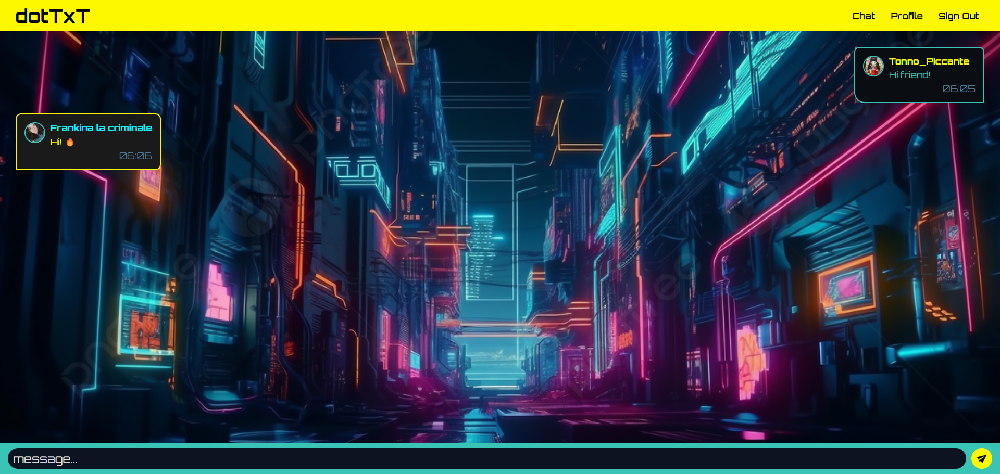
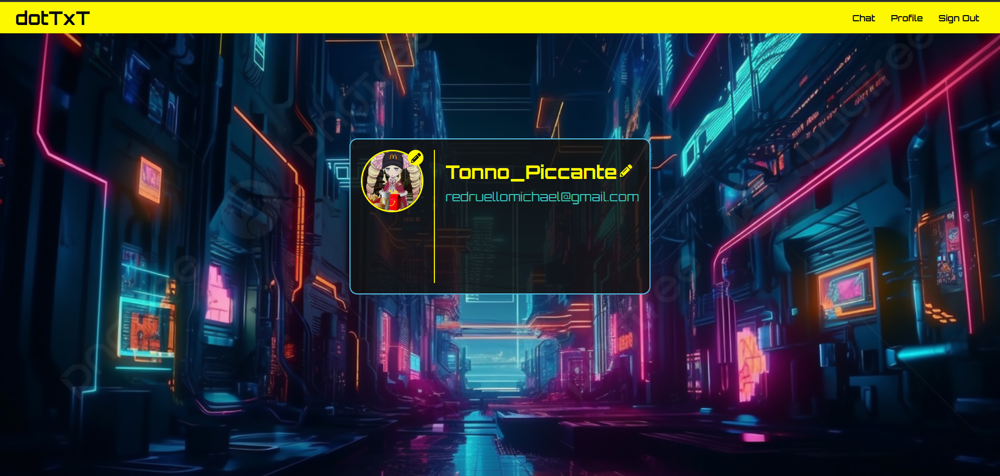

# dotTxT - Real-Time Chat App

A real-time chat application inspired by CryberPunk 2077 built with **React**, **Firebase**, and **Express.js**.

## 🚀 Features

- **Google Authentication** via Firebase Auth
- **Real-time Messaging** with Firestore
- **Profile Editing** (Name & Profile Picture)
- **Automatic Message Deletion** via a Scheduled Cron Job

---

## 📌 Tech Stack

- **Frontend:** React, Firebase Authentication, Firestore
- **Backend:** Express.js, Firebase Admin SDK
- **Hosting:** Firebase Hosting / Render (Backend)

---

## 🔧 Setup & Installation

### 1️⃣ Clone the Repository

```sh
git clone https://github.com/michaelredruello/chat-app.git
cd chat-app
```

### 2️⃣ Install Dependencies

```sh
npm install
```

### 3️⃣ Setup Firebase

1. Create a Firebase project at [Firebase Console](https://console.firebase.google.com/)
2. Enable **Authentication** (Google Sign-In)
3. Enable **Firestore Database**
4. Create a `.env` file in the root and add:

```env
REACT_APP_FIREBASE_API_KEY=your-api-key
REACT_APP_FIREBASE_AUTH_DOMAIN=your-auth-domain
REACT_APP_FIREBASE_PROJECT_ID=your-project-id
REACT_APP_FIREBASE_STORAGE_BUCKET=your-storage-bucket
REACT_APP_FIREBASE_MESSAGING_SENDER_ID=your-messaging-sender-id
REACT_APP_FIREBASE_APP_ID=your-app-id
```

### 4️⃣ Run the Development Server

```sh
npm start
```

---

## 🔥 Backend Setup (Message Deletion API)

### 1️⃣ Install Dependencies

```sh
cd server
npm install
```

### 2️⃣ Setup Firebase Admin SDK

Create a `.env` file inside the `server/` directory:

```env
PORT=5000
FIREBASE_PROJECT_ID=your-project-id
FIREBASE_CLIENT_EMAIL=your-client-email
FIREBASE_PRIVATE_KEY=your-private-key
```

### 3️⃣ Run the Server

```sh
node server.js
```

### 4️⃣ API Endpoint

- **DELETE Messages:** `GET /deleteMessages`
- Use a **cron job** to trigger this API periodically.

---

## 🌐 App Link

- [**dotTxT**](https://dottxt-5993e.firebaseapp.com/) - Chaothic temporary chat

---

## 🎨 UI Screenshots





---

## 📬 Contact

For issues or suggestions,contact me at [redruellomichael@gmail.com].
