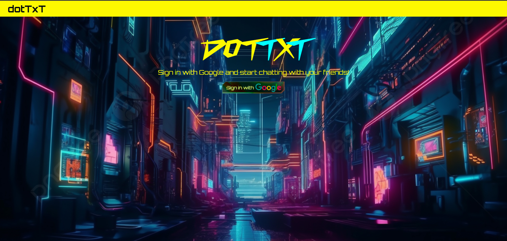

# dotTxT - Real-Time Chat App

A real-time chat application inspired by CryberPunk 2077 built with **React**, **Firebase**, and **Express.js**.

## 🚀 Features

- **Google Authentication** via Firebase Auth
- **Real-time Messaging** with Firestore
- **Profile Editing** (Name & Profile Picture)
- **Automatic Message Deletion** via a Scheduled Cron Job

---

## 📌 Tech Stack

- **Frontend:** React, Firebase Authentication, Firestore
- **Backend:** Express.js, Firebase Admin SDK
- **Hosting:** Firebase Hosting / Render (Backend)

---

## 🌐 App Link

- **dotTxT** https:/dottxt-5993e.firebaseapp.com/

---

## 🎨 UI Screenshots

---

## 📬 Contact

For issues or suggestions,contact me at [redruellomichael@gmail.com].
